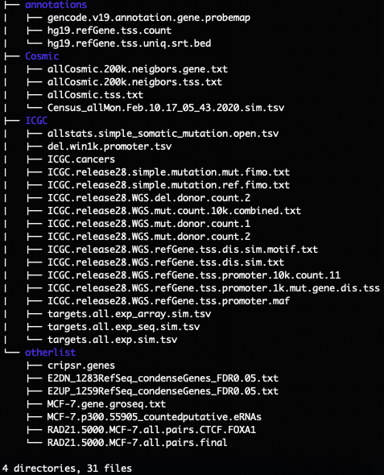

# ERR-project
Associated Scripts for ERR (Enhancer Release and Retargeting) project

# Before start:
1. get data associated for all the R scripts from http://www.fawnshao.info.sh/data/project.ERR.figdata.tar.gz
   extract it with "tar zxvf project.ERR.figdata.tar.gz"
   
2. or go to prepareData folder, (1) run run.GROseq.and.CTCFmotif.sh; (2) get all ICGC data from https://dcc.icgc.org/
   and run prepare.data.sh followed by prepare.del.win1k.promoter.tsv.R to generate related input files for R script; 
   
# File structure in project.ERR.figdata.tar.gz
